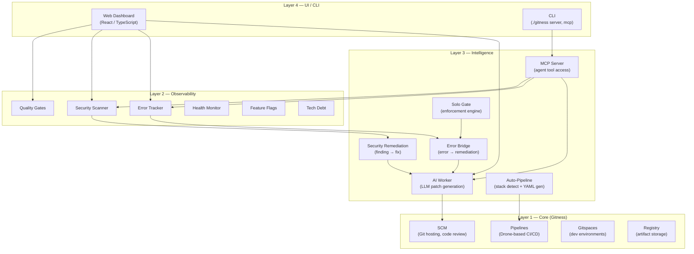
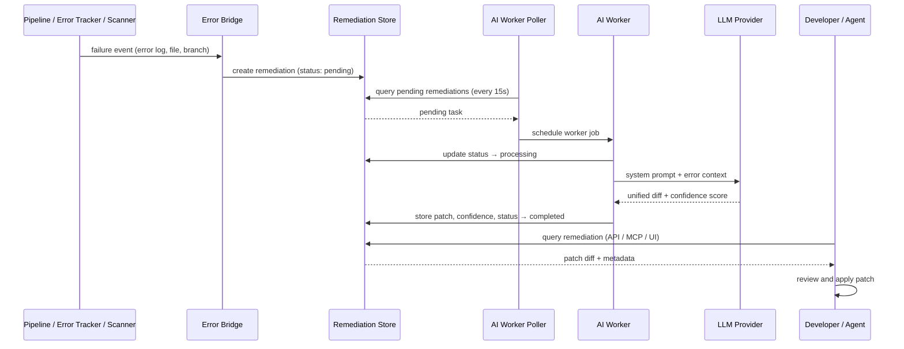

# Architecture

SoloDev is an open-source DevOps platform built on [Gitness by Harness](https://github.com/harness/gitness). It extends the Gitness core (Git hosting, CI/CD pipelines, Gitspaces, artifact registries) with an intelligence layer that connects runtime failures and security findings to AI-generated code fixes. This page documents the system's layered architecture, module structure, and AI remediation data flow.

## System Layers

SoloDev is organized into four layers. The bottom two are inherited from Gitness; the top two are SoloDev-specific additions.



## Module Map

Each module maps to concrete Go packages in the repository. All SoloDev modules follow the same structure: types in `types/`, controller logic in `app/api/controller/`, HTTP handlers in `app/api/handler/`, database access in `app/store/database/`, and domain events in `app/events/`.

### Layer 4 — UI / CLI

| Component | Package / Path | Description |
|-----------|---------------|-------------|
| Web Dashboard | `web/src/pages/SoloDevDashboard/` | React/TypeScript UI with summary cards for all modules |
| Module Pages | `web/src/pages/{ErrorList,SecurityScanList,...}/` | Per-module list and detail views |
| CLI | `cmd/gitness/` | Server startup, MCP transport commands |

### Layer 3 — Intelligence

| Component | Package / Path | Description |
|-----------|---------------|-------------|
| AI Worker | `app/services/aiworker/` | Background job polls pending remediations, calls LLM (Anthropic/OpenAI/Gemini/Ollama), parses unified diff + confidence score |
| Error Bridge | `app/services/errorbridge/` | Auto-creates remediation tasks when errors are reported or pipelines fail |
| Solo Gate | `app/services/sologate/` | Evaluates findings against enforcement mode (strict/balanced/prototype), triggers remediation or logs tech debt |
| Auto-Pipeline | `app/pipeline/autopipeline/` | Detects tech stack from file paths, generates CI/CD YAML |
| MCP Server | `mcp/` | 16 atomic tools, 5 compound tools, 7 resources, 5 prompts; stdio + HTTP transports |
| Security Remediation | `app/services/securityremediation/` | Auto-creates remediation tasks from security scan findings |

### Layer 2 — Observability

| Component | Package / Path | Description |
|-----------|---------------|-------------|
| AI Remediation | `app/api/controller/airemediation/` | CRUD for remediation tasks, status tracking, patch storage |
| Error Tracker | `app/api/controller/errortracker/` | Error group management, occurrence tracking, fingerprinting |
| Security Scanner | `app/api/controller/securityscan/` | Scan triggers, finding management, severity classification |
| Quality Gates | `app/api/controller/qualitygate/` | Rule CRUD, evaluation engine for coverage/complexity/style |
| Health Monitor | `app/api/controller/healthcheck/` | HTTP endpoint monitoring, uptime tracking, result history |
| Feature Flags | `app/api/controller/featureflag/` | Boolean and multivariate flags per space |
| Tech Debt | `app/api/controller/techdebt/` | Debt item tracking with severity and categorization |

### Layer 1 — Core (Gitness)

| Component | Package / Path | Description |
|-----------|---------------|-------------|
| SCM | `app/api/controller/repo/` | Git hosting, pull requests, code review, webhooks |
| Pipelines | `app/pipeline/` | Drone-based CI/CD execution |
| Gitspaces | `app/api/controller/gitspace/` | Cloud development environments |
| Registry | `registry/` | OCI artifact and container registry |

## Database

SoloDev uses SQLite for local development and PostgreSQL for production. Schema migrations are numbered:

| Migration | Tables |
|-----------|--------|
| 0102 | `security_scans`, `scan_findings` |
| 0103 | `health_checks` |
| 0104 | `health_check_results` |
| 0105 | `quality_rules`, `quality_evaluations` |
| 0171 | `error_groups`, `error_occurrences` |
| 0172 | `remediations` |

## AI Remediation Data Flow

The remediation loop is SoloDev's core differentiator: it connects failure detection to patch generation without manual intervention. Here is the flow as currently implemented.

### Step-by-step

1. **Trigger detected.** A pipeline fails (build error, test failure) or a runtime error is reported via the Error Tracker API, or a security scan produces findings.

2. **Error Bridge creates remediation task.** The Error Bridge (`app/services/errorbridge/bridge.go`) receives the event and creates a `Remediation` record with status `pending`. The record includes the error log, file path, branch, commit SHA, and available source code context. For security findings, the Security Remediation service performs the same role.

3. **AI Worker picks up the task.** A background poller (`app/services/aiworker/worker.go`) runs every 15 seconds, queries for `pending` remediations, and schedules a worker job for each. The worker marks the task as `processing`.

4. **LLM generates a patch.** The worker builds a prompt from the error context — file path, branch, commit, error log, source code — and sends it to the configured LLM provider (Anthropic, OpenAI, Google Gemini, or Ollama). The system prompt instructs the LLM to produce a unified diff (`patch -p1` compatible) with a confidence score between 0.0 and 1.0.

5. **Response parsed and stored.** The response parser (`app/services/aiworker/parser.go`) extracts the diff block and confidence score. The remediation record is updated with the patch diff, AI response, model identifier, and confidence. Status changes to `completed` (if a diff was produced) or `failed`.

6. **Developer reviews.** The developer views the patch via the web dashboard, REST API, or MCP tools. Current application: the developer copies and applies the diff manually, or an MCP-connected AI agent retrieves and applies it.

### Sequence Diagram



### Planned Additions

The current implementation sends error context and available source code directly in the LLM prompt. The following enhancements are planned but not yet implemented:

- **Vector retrieval (Code Context Engine):** Embedding-based search over the full repository to provide richer context to the LLM, beyond the source code stored in the remediation record.
- **Auto-PR creation:** Automatically open a pull request from the generated patch diff, with the AI response as the PR description.
- **Auto-merge:** For patches with confidence above a configurable threshold, optionally auto-merge without developer review.
- **Self-healing pipeline loop:** After generating and applying a fix, automatically re-trigger the failed pipeline to verify the patch resolves the failure.

See [Roadmap](Roadmap) for the full milestone plan.

## API Layer

All SoloDev modules are exposed under `/api/v1/spaces/{space_ref}/`:

```
remediations/       errors/             quality-gates/
security-scans/     health-checks/      tech-debt/
feature-flags/      auto-pipeline/
```

The MCP server is available at `/mcp` (HTTP transport) and via `./gitness mcp stdio` (stdio transport). See [API Reference](API-Reference) for the full endpoint listing and [MCP Server](MCP-Server) for the tool reference.

## Authentication

All API requests require a Bearer token (Personal Access Token) in the `Authorization` header. The MCP stdio transport reads the token from the `SOLODEV_TOKEN` environment variable. See [Getting Started](Getting-Started) for setup instructions.
