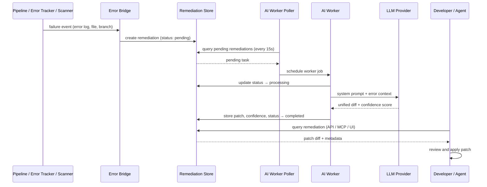

# Data Flow

This page describes how data moves between components in SoloDev, from signal ingestion through AI processing to remediation output.

## AI Remediation Data Flow

The remediation loop is SoloDev's core data flow: it connects failure detection to patch generation without manual intervention.

### Step-by-step

1. **Trigger detected.** A pipeline fails (build error, test failure) or a runtime error is reported via the Error Tracker API, or a security scan produces findings.

2. **Error Bridge creates remediation task.** The Error Bridge (`app/services/errorbridge/bridge.go`) receives the event and creates a `Remediation` record with status `pending`. The record includes the error log, file path, branch, commit SHA, and available source code context. For security findings, the Security Remediation service performs the same role.

3. **AI Worker picks up the task.** A background poller (`app/services/aiworker/worker.go`) runs every 15 seconds, queries for `pending` remediations, and schedules a worker job for each. The worker marks the task as `processing`.

4. **LLM generates a patch.** The worker builds a prompt from the error context — file path, branch, commit, error log, source code — and sends it to the configured LLM provider (Anthropic, OpenAI, Google Gemini, or Ollama). The system prompt instructs the LLM to produce a unified diff (`patch -p1` compatible) with a confidence score between 0.0 and 1.0.

5. **Response parsed and stored.** The response parser (`app/services/aiworker/parser.go`) extracts the diff block and confidence score. The remediation record is updated with the patch diff, AI response, model identifier, and confidence. Status changes to `completed` (if a diff was produced) or `failed`.

6. **Developer reviews.** The developer views the patch via the web dashboard, REST API, or MCP tools. Current application: the developer copies and applies the diff manually, or an MCP-connected AI agent retrieves and applies it.

### Sequence Diagram



## Signal Ingestion Flow

```
External Source                   SoloDev Module              Database
─────────────                   ──────────────              ────────
Application error report    →   Error Tracker           →   error_groups, error_occurrences
Pipeline completion event   →   Pipeline Runner         →   (pipeline tables, inherited)
Security scan request       →   Security Scanner        →   security_scans, scan_findings
Quality evaluation trigger  →   Quality Gates           →   quality_rules, quality_evaluations
HTTP health check           →   Health Monitor          →   health_checks, health_check_results
Feature flag toggle         →   Feature Flags           →   (feature flag tables)
Tech debt creation          →   Tech Debt Tracker       →   (tech debt tables)
```

## MCP Data Flow

```
AI Agent ──▶ MCP Client ──▶ JSON-RPC ──▶ MCP Server ──▶ Controller ──▶ Database
                                              │
                                              ├──▶ tools/call  → Atomic/Compound tool execution
                                              ├──▶ resources/read → Live platform state
                                              └──▶ prompts/get → Pre-built reasoning chains
```

## API Data Flow

All REST API requests follow the same path:

```
HTTP Request → Router → Handler → Controller → Store → Database
                                      │
                                      └──▶ Event Publisher → Subscribers
```

Events are published after successful state changes. Subscribers include the Error Bridge (for error events) and the Security Remediation service (for scan events).

## Database Layout

All data is stored in a single database instance (SQLite for development, PostgreSQL for production). There is no separate cache layer, message queue, or search index in the current implementation. The AI Worker Poller reads directly from the database. This simplifies deployment at the cost of limiting throughput — acceptable for the solo-developer target audience.
