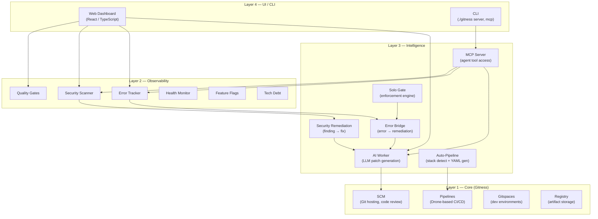

# Architecture Overview

SoloDev is an open-source DevOps platform built on [Gitness by Harness](https://github.com/harness/gitness). It extends the Gitness core (Git hosting, CI/CD pipelines, Gitspaces, artifact registries) with an intelligence layer that connects runtime failures and security findings to AI-generated code fixes. This page is the canonical architecture reference.

## Master Architecture Diagram

This diagram is the anchor for the entire project. Every component described in the documentation maps to a node in this diagram.

```
┌─────────────────────────────────────────────────────────────────────────────────┐
│                              DEVELOPER / AGENT                                  │
│                                                                                 │
│   Writes code ──▶ Pushes to repo ──▶ Reviews fixes ──▶ Approves/merges         │
│                                                                                 │
└──────────┬──────────────────────────────────────────────────────────┬────────────┘
           │                                                          ▲
           ▼                                                          │
┌──────────────────────────────────────────────────────────────────────────────────┐
│                               PLATFORM (SoloDev)                                │
│                                                                                 │
│   ┌──────────────┐  ┌──────────────┐  ┌──────────────┐  ┌──────────────┐       │
│   │  Source       │  │  Pipelines   │  │  Gitspaces   │  │  Registry    │       │
│   │  Control      │  │  (CI/CD)     │  │  (Dev Envs)  │  │  (Artifacts) │       │
│   └──────┬───────┘  └──────┬───────┘  └──────────────┘  └──────────────┘       │
│          │                 │                                                     │
│          ▼                 ▼                                                     │
│   ┌─────────────────────────────────────────────────────────────┐               │
│   │                    SIGNAL SYSTEM                             │               │
│   │                                                              │               │
│   │  ┌────────────┐ ┌────────────┐ ┌────────────┐ ┌──────────┐ │               │
│   │  │ Error      │ │ Security   │ │ Quality    │ │ Health   │ │               │
│   │  │ Tracker    │ │ Scanner    │ │ Gates      │ │ Monitor  │ │               │
│   │  └─────┬──────┘ └─────┬──────┘ └─────┬──────┘ └─────┬────┘ │               │
│   │        │               │               │              │      │               │
│   └────────┼───────────────┼───────────────┼──────────────┼──────┘               │
│            │               │               │              │                      │
│            ▼               ▼               ▼              ▼                      │
│   ┌─────────────────────────────────────────────────────────────┐               │
│   │                    AI LAYER                                  │               │
│   │                                                              │               │
│   │  ┌────────────┐ ┌────────────┐ ┌────────────┐ ┌──────────┐ │               │
│   │  │ Error      │ │ AI Worker  │ │ Context    │ │ Prompt   │ │               │
│   │  │ Bridge     │ │ (LLM)     │ │ Engine     │ │ Templates│ │               │
│   │  └────────────┘ └─────┬──────┘ └────────────┘ └──────────┘ │               │
│   │                       │                                      │               │
│   └───────────────────────┼──────────────────────────────────────┘               │
│                           ▼                                                      │
│   ┌─────────────────────────────────────────────────────────────┐               │
│   │                 REMEDIATION SYSTEM                           │               │
│   │                                                              │               │
│   │  ┌────────────┐ ┌────────────┐ ┌────────────┐ ┌──────────┐ │               │
│   │  │ Patch      │ │ Confidence │ │ Validation │ │ Approval │ │               │
│   │  │ Generation │ │ Scoring    │ │ Engine     │ │ Workflow │ │               │
│   │  └────────────┘ └────────────┘ └────────────┘ └──────┬───┘ │               │
│   │                                                       │      │               │
│   └───────────────────────────────────────────────────────┼──────┘               │
│                                                           │                      │
└───────────────────────────────────────────────────────────┼──────────────────────┘
                                                            │
                                                            ▼
                                                    Applied fix returns
                                                    to Developer / Agent

Developer → Platform → Signals → AI → Remediation → Developer
```

## System Layers

SoloDev is organized into four layers. The bottom two are inherited from Gitness; the top two are SoloDev-specific additions.



## Module Map

Each module maps to concrete Go packages in the repository. All SoloDev modules follow the same structure: types in `types/`, controller logic in `app/api/controller/`, HTTP handlers in `app/api/handler/`, database access in `app/store/database/`, and domain events in `app/events/`.

### Layer 4 — UI / CLI

| Component | Package / Path | Description |
|-----------|---------------|-------------|
| Web Dashboard | `web/src/pages/SoloDevDashboard/` | React/TypeScript UI with summary cards for all modules |
| Module Pages | `web/src/pages/{ErrorList,SecurityScanList,...}/` | Per-module list and detail views |
| CLI | `cmd/gitness/` | Server startup, MCP transport commands |

### Layer 3 — Intelligence

| Component | Package / Path | Description |
|-----------|---------------|-------------|
| AI Worker | `app/services/aiworker/` | Background job polls pending remediations, calls LLM, parses unified diff + confidence score |
| Error Bridge | `app/services/errorbridge/` | Auto-creates remediation tasks when errors are reported or pipelines fail |
| Solo Gate | `app/services/sologate/` | Evaluates findings against enforcement mode (strict/balanced/prototype), triggers remediation or logs tech debt |
| Auto-Pipeline | `app/pipeline/autopipeline/` | Detects tech stack from file paths, generates CI/CD YAML |
| MCP Server | `mcp/` | Runtime-gated MCP tools/resources/prompts with stdio + HTTP transports and a catalog that separates active, blocked, and coming-soon surfaces |
| Security Remediation | `app/services/securityremediation/` | Auto-creates remediation tasks from security scan findings |

### Layer 2 — Observability

| Component | Package / Path | Description |
|-----------|---------------|-------------|
| AI Remediation | `app/api/controller/airemediation/` | CRUD for remediation tasks, status tracking, patch storage |
| Error Tracker | `app/api/controller/errortracker/` | Error group management, occurrence tracking, fingerprinting |
| Security Scanner | `app/api/controller/securityscan/` | Scan triggers, finding management, severity classification |
| Quality Gates | `app/api/controller/qualitygate/` | Rule CRUD, evaluation engine for coverage/complexity/style |
| Health Monitor | `app/api/controller/healthcheck/` | HTTP endpoint monitoring, uptime tracking, result history |
| Feature Flags | `app/api/controller/featureflag/` | Boolean and multivariate flags per space |
| Tech Debt | `app/api/controller/techdebt/` | Debt item tracking with severity and categorization |

### Layer 1 — Core (Gitness)

| Component | Package / Path | Description |
|-----------|---------------|-------------|
| SCM | `app/api/controller/repo/` | Git hosting, pull requests, code review, webhooks |
| Pipelines | `app/pipeline/` | Drone-based CI/CD execution |
| Gitspaces | `app/api/controller/gitspace/` | Cloud development environments |
| Registry | `registry/` | OCI artifact and container registry |

## Database

SoloDev uses SQLite for local development and PostgreSQL for production. Schema migrations are numbered:

| Migration | Tables |
|-----------|--------|
| 0102 | `security_scans`, `scan_findings` |
| 0103 | `health_checks` |
| 0104 | `health_check_results` |
| 0105 | `quality_rules`, `quality_evaluations` |
| 0171 | `error_groups`, `error_occurrences` |
| 0172 | `remediations` |

## Authentication

All API requests require a Bearer token (Personal Access Token) in the `Authorization` header. The MCP stdio transport reads the token from the `SOLODEV_TOKEN` environment variable. See [Getting Started](../Getting-Started/Quick-Start) for setup instructions.
